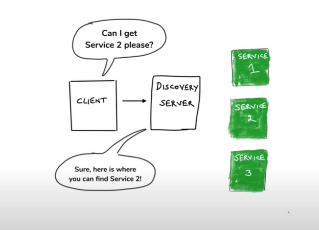
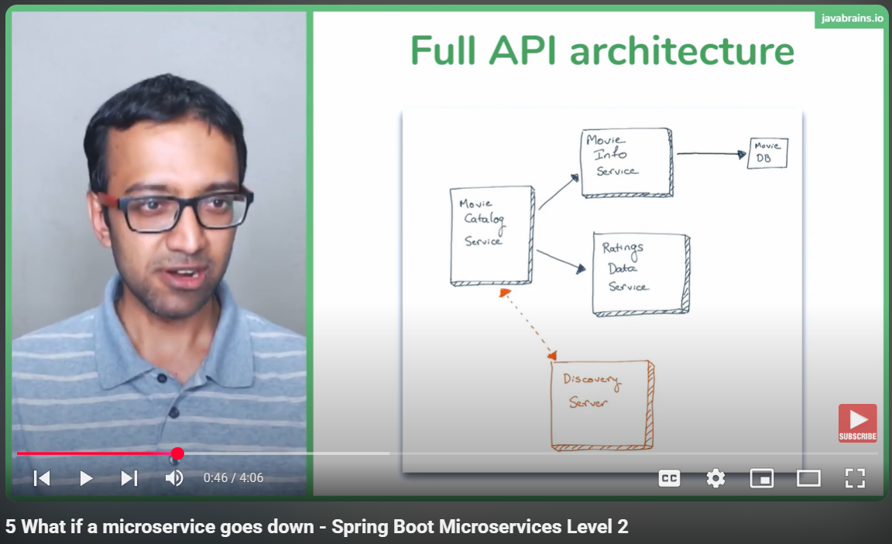
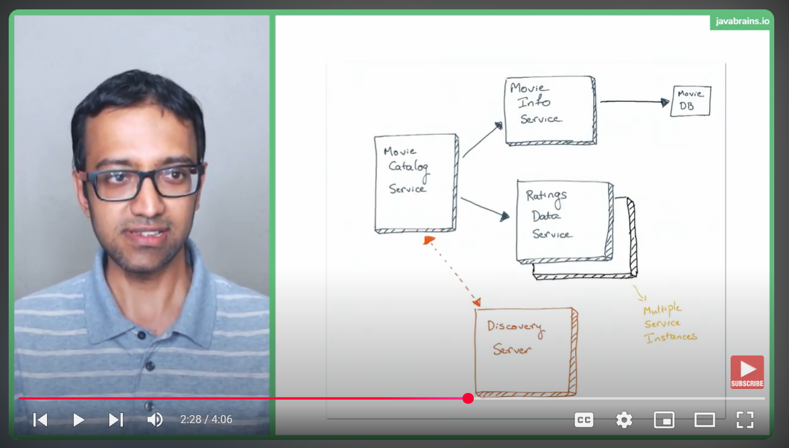
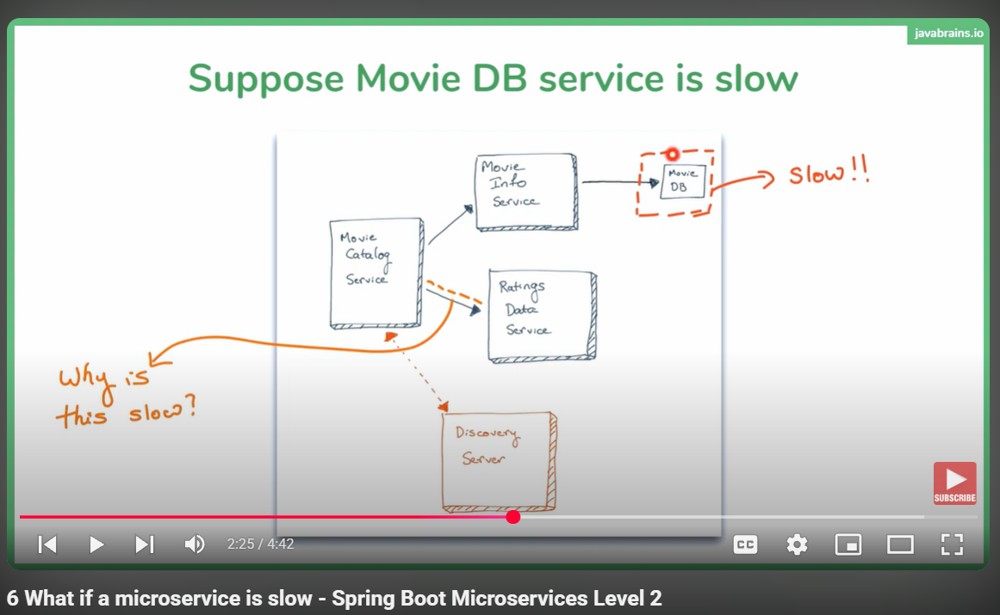

# Microservices Overview
------------------------------------------------------------------------------------------------------------------------
- The fundamental idea is to develop applications in a modern way.
- Traditionally, applications are developed using a single codebase or multiple codebases, but what gets deployed is one entity on a single server.
- The primary difference between **monolithic** and **microservices** architecture:
    - **Monolithic**: Deployed as a whole entity on a single server.
    - **Microservices**: Each codebase is deployed on different servers.
- In other words, while coding patterns remain similar, the deployment approach is significantly different.
- There are many ways to develop microservices, and **Spring Cloud** is just one of the many technologies available for creating microservices.
- Each technology follows certain architectural **patterns**.
- The biggest challenge in developing microservices is their **interdependency**.
- Microservices solve generic problems like **load balancing**, which is why multiple technologies exist in the market—each solving a distinct problem.

### Audience Question: What is an example of a pattern and technology? What is the difference?

**Answer:**  
When an application is broken down into different services, different **patterns** are required for microservices to communicate with each other.
A good example is **Service Discovery**, which helps discover services and facilitates communication in a microservices architecture.
On the other hand, **technology** refers to tools or frameworks that implement these patterns. For example, **Eureka** is a technology that follows the Service Discovery pattern.

------------------------------------------------------------------------------------------------------------------------

- **@Bean** is the producer (registerer) while **@Autowired** is the consumer / subscriber 
- **@Bean** by default creates singleton object for each spring bean
- **RestTemplate** is an inbuilt way of calling microservices in spring framework
- **WebClient** is an alternative way of RestTemplate and RestTemplate has been deprecated long time ago.
  WebClient comes with `WebFlux` dependency and is an asynchronous way of interacting with microservices

### What is Mono?

#### Conceptual Definition
**"Mono is a reactive type in Spring WebFlux that represents a stream of zero or one element, enabling asynchronous and non-blocking programming."**

####  Practical Definition
**"In WebFlux, when making an API call like `webClient.get().retrieve().bodyToMono(Movie.class)`, it returns a `Mono<Movie>`, meaning the movie data will be available asynchronously when subscribed to
and can be used later once available."**

### Why you should avoid returning lists in APIs?
Returning a raw list in a REST API response lacks metadata, making it harder to include pagination, status codes, or error handling. Wrapping the list in an object ensures consistency, scalability, and flexibility for future enhancements.
Imagine you want to add a new property, like `totalItems`, to track how many items are in the list. If you return just a list, there's no easy way to include this property:
```json
[
  { "id": 1, "name": "Item 1" },
  { "id": 2, "name": "Item 2" }
]
```
**Recommended**: Instead, the response can be wrapped in an object that includes metadata along with the data:
```json
{
  "status": "success",
  "data": [
    { "id": 1, "name": "Item 1" },
    { "id": 2, "name": "Item 2" }
  ],
  "totalItems": 2
}
```

------------------------------------------------------------------------------------------------------------------------
### What are we doing wrong here?
So far we were communicating microservices via RestTemplate and WebClient and hardcoding API URLs

### Why Hardcoded URLs are bad?
- Changes require code updates
- Dynamic URLs in the cloud -> When we deploy microservices on cloud for example Heroku, then we don't have any idea
  what would be the API URLs
- Load Balancing
- Multiple environments -> In real-world applications, it's common to deploy across multiple environments 
  (e.g., development, staging, production). Hardcoding URLs makes it difficult to handle different 
  environments for several reasons

So, because of all these drawbacks, we have `Service Discovery (A Pattern)` which helps microservices discover and talk to each other

### Service Discovery in Spring Cloud



Service discovery in Spring Cloud plays a crucial role in systems following a microservices architecture, as shown in the diagram. Here’s how it works:

- **Discovery Server (Registry)** : At the heart of service discovery is a discovery server, like **Eureka** (a widely-used component in Spring Cloud). This server acts as a registry where all the microservices register themselves. It's like a phonebook for services.

- **Service Registration** : Each microservice (such as **SRV 1**, **SRV 2**, and **SRV 3** in the diagram) registers its details (like hostname, port, etc.) with the discovery server. This allows other services to locate it dynamically rather than relying on hardcoded configurations.

- **Client-Side Service Discovery** : When the client (in this case, the **CLIENT** box in the diagram) needs to communicate with a specific service, it queries the discovery server to get the relevant information. This ensures flexibility and scalability, as services can be added or removed without affecting the client directly.

- **Load Balancing** : If multiple instances of a service exist (e.g., several instances of **SRV 1**), the discovery server can provide the client with all available instances. Tools like **Ribbon** (Spring Cloud Load Balancer) help to distribute requests across these instances efficiently.

- **Dynamic Updates** : The registry is updated dynamically, so if a service goes down or is brought up, the discovery server maintains an accurate and current list of available services.

Now, what happens in the above diagram for `Client Side Service Discovery`, each of those `services` which want to be discovered by the `Client`, register themselves with that `Discovery Server`.
In other words, `Service Discovery` is like a phone book guy which is maintaining a `Phone Book` and all these people are kind of 
providing the entries into the phone book. Whoever needs to make a call looks up the phone book and gets the address

`Remember : Spring Cloud uses the Client Side Service Discovery`

### What's Eureka Server?
Eureka Server is like the “address book” for microservices in Spring Cloud applications. Imagine you're building an online food delivery app with multiple services like:
- Order Service: Handles placing and tracking food orders.
- Restaurant Service: Manages restaurant menus and availability.
- Delivery Service: Coordinates with delivery agents.

Each service runs independently, but they need to talk to each other. Instead of hardcoding their locations (like IP addresses or URLs), which is unreliable in a dynamic environment, they can use Eureka Server to discover each other.

How it Works:
- Service Registration: All microservices (Order, Restaurant, Delivery) register themselves with Eureka Server when they start up. Eureka Server saves their details (hostnames, ports, etc.).
- Service Discovery: When one service (e.g., Order Service) wants to talk to another (e.g., Delivery Service), it asks Eureka Server for the latest location instead of relying on a hardcoded address.

## ⚠️ Fault Tolerance in Spring Microservices

Fault tolerance = Keeping your system **alive and responsive**, even when parts of it fail.

### 🧰 Key Tools (with Resilience4j):

- **Circuit Breaker** 🧯  
  Stops calling a failing service to avoid making things worse. Falls back to defaults.

- **Retry** 🔁  
  Tries a few times before giving up. Useful for temporary network hiccups.

- **Rate Limiter** 🚦  
  Controls traffic to prevent service overload.

- **Bulkhead** 🛡️  
  Isolates resources (like thread pools) to prevent a failure from sinking the entire system.

> 💡 Think of it as airbags for your microservices!

---

## 🧭 When Eureka Server Goes Down

### 😱 What breaks?
- ❌ New services can't register
- ❌ New services can't discover others (if not cached)
- ❌ No health checks or heartbeats

### 😌 What still works?
- ✅ Already-discovered services can still talk using cached registry
- ✅ Temporary survival thanks to local cache

### 🛠️ How to reduce impact:
- 🔁 Use **multiple Eureka servers** for high availability
- 🧠 Leverage **self-preservation mode** to avoid accidental instance removal
- 💾 Keep **registry fetch interval** short for fresher local cache

> 💬 Eureka down ≠ total blackout — just don't stay in single-server mode!

> # 🚀 Spring Boot Microservices - Fault Tolerance & Resilience (Level 2)

## 🎯 Workshop Focus

Welcome to **Level 2** of microservices with Spring Boot — where we focus on making systems **fault-tolerant** and **resilient**.

> "Before you learn a tool, understand the **problem** it solves."

This session is all about the **"why"** behind resilience, not just the "how."

---

## 🔍 Challenges with Availability

Microservices bring scalability and modularity, but also create **fragile interdependencies**.

### 🧠 What can go wrong?
- One service failing might **impact many others**
- Delays in one part may **slow down the entire system**
- **Unexpected downtime** or **network glitches** are inevitable

> Real-world example:  
> In a ride-hailing app, if the location service is down, should the app crash — or still let users browse?

---

## ⚠️ Why Do We Need Fault Tolerance?

Microservices need to handle failure **gracefully** to:
- Improve **system availability**
- Prevent **cascading failures**
- Maintain a **good user experience** even when things break

### Key Insight:
> You can't **prevent** all failures, but you can design systems that **recover from them**.

---

## 🧠 Resilience — It's a Mindset

This workshop emphasizes:
- Understanding **core resilience principles**
- Concepts that are **framework-agnostic**
- Patterns that remain **relevant**, whether you're using Spring Boot, Node.js, or Go

---

## 📦 Tech Stack (Used in this Workshop)

We'll be using:
- **Spring Boot** for microservices
- **Hystrix** (as an example library — focus is on concept, not the tool)

But remember — the goal is to **understand resilience**, not just implement Hystrix.

---

### What is Fault Tolerance?
> Given an application, if there's a fault; what is the impact of that fault? How much `Tolerance` does the system
have for a specific fault? Let's say, if one microservices instances were to go down, what's gonna to happen with your microservices'
application? Is your whole microservices application go down? Or is it a part of that application functionality that goes down?
Or we have some way of handling failures, so that there's no perceived impact at all on our microservices' application?

> So, in nutshell, what tolerance your system has for a particular fault is what's called `Fault Tolerance`

### What is Fault Resilience?
> `Resilience` is basically how many faults a system can tolerate and that indicates how resilient the system is. The first one you're looking at single fault 
> and saying, how much system can tolerate a single fault? And `Resilience` is how many faults can system tolerate before its brought down to its knees?
> `A part of resilience is how many times a system can bounce back  from a fault?`

> So, very similar concepts but slight differences. `You can technically have a system that's very fault tolerant but it's not resilient
> but its hard because most of the time these two go to gather and it's good to focus on the both.`

> # Full API Architecture
> So, here's the full API Architecture so far. We have three services again but `MovieInfoService` is calling an external API, `MovieDB API`.
A slight addition we added to microservices but nothing big, nothing significant; very simple stuff.



### 🔁 Making Microservices Resilient
---

## 🤔 The Big Question

> “What can we do to make this resilient?”

Right now, we’re dealing with the **least fault-tolerant microservices setup** imaginable:
- No error handling
- No retry logic
- No service duplication
- One instance per service
- No `try-catch`, no recovery logic

In short:  
**If any service fails, the whole system crashes.**

---

## 📉 Example Breakdown

Let’s look at the **Movie Catalog Service**:
- It fetches data from `Movie Info Service`
- Then it fetches data from `Rating Service`
- It compiles both into a response

🔗 If **either of those two services** goes down,  
📉 **Movie Catalog fails** — and so does the user request.

---

## 🧱 This Is NOT Resilient

And that’s *actually great news* — because this is the perfect foundation for learning resilience.

> To make something fault-tolerant, you must first understand what makes it fragile.

---

## 💥 What Can Go Wrong in Microservices?

Here’s a real-world scenario:

### ❌ One Instance Goes Down
- Services are running as single instances.
- If one instance fails, **boom 💥 — the entire flow breaks**.

So… how do we avoid this?

---

## 🛠️ First Real Fix: **Redundancy**

### ✅ Run Multiple Instances
- Deploy more than one instance of each microservice.
- Distribute them across:
  - Different machines (best for production)
  - Or different ports on the same machine (okay for dev/testing)



---

## 🔄 Load Balancing + Service Discovery

Thanks to **Eureka** (our service registry), things get smoother:

1. Each service instance registers itself to Eureka
2. Eureka tracks **all active instances**
3. Clients (like Movie Catalog) use **client-side load balancing** (via Ribbon)
4. Ribbon does a **round-robin**:
  - If there are 2 instances, it alternates calls between them

So if one instance fails, traffic automatically shifts to the next available one — no manual intervention needed (most of the time 😉).

---

## 📈 Benefits of This Setup

- ✅ **High Availability**: Traffic reroutes automatically
- ✅ **Fault Isolation**: Failure in one instance doesn’t bring everything down
- ✅ **Better Scalability**: Load gets evenly distributed
- ✅ **Graceful Degradation**: Some services still function even when others are down

---

## 🧠 Key Insight

> “You don’t want your entire app to go down just because one instance fails.”

This is a **basic**, yet powerful step in making your microservices **resilient and production-ready**.

---

> # 🐢 What If a Microservice is Slow?
---

## 🧠 Common Assumption

> "If a microservice is **slow**, it’s not a big deal. At least it’s not down, right?"

Turns out... that’s a **dangerous misconception**.



---

## ⚠️ Problem Scenario: The Hidden Danger

Let's visualize a chain of services:

- **Movie Catalog Service**  
  → Calls → **Movie Info Service**  
  → Then Calls → **Rating Data Service**

Now imagine **Movie Info Service becomes slow** (not down, just delayed).  
What could possibly go wrong?

---

## 💥 Cascade of Slowness

Even if only one service (like Movie Info) is slow:
- Entire dependent APIs (like Catalog) become slow.
- ❗ But here's the surprising part: **even unrelated APIs can become slow.**

### 🎯 Example:

- `GET /catalog/user/123` → Slowed down (makes sense, depends on Movie Info)
- `GET /ratings/user/123` → ALSO slowed down ❓ (even though it only talks to Ratings Data Service)

---

## ❓ Why Does This Happen?

> The real culprit: **Threads**

When using Spring Boot (or any Java-based backend):
- Each incoming HTTP request is handled by a **thread**.
- Threads wait until they receive a response from downstream services.

So if one service (like Movie Info) is slow:
- Threads handling that request get **blocked**.
- The **thread pool gets exhausted**, even for unrelated API calls.

> 🔄 This leads to system-wide slowness or even complete unresponsiveness.

---

## 🔍 Misleading Assumptions

- ❌ “Only calls depending on the slow service will be affected”
- ✅ Reality: **Any part of the system** might suffer if thread starvation occurs

---

## 🧵 Quick Primer: Why Threads Matter

In Java web servers:
- There’s a limited pool of threads (e.g., 200)
- Each request consumes 1 thread
- If a downstream service is slow, threads stay busy waiting
- Soon... **no threads are left** to handle new requests!

---

## 🧠 Key Takeaway

> “A slow service can be as dangerous as a failed one.”

Even one sluggish microservice can bring the entire application to its knees.

---

> # 🧵 The Problem with Threads in Spring Boot Microservices
---

## 🧠 How Web Servers Handle Requests

When a **request** hits a **web server** (e.g., Tomcat):
- The server **creates a thread** to handle it.
- The thread processes the request, sends a response, and is then **freed**.

### ✅ All Good When...
- Requests come in slowly.
- Each thread finishes quickly.
- Threads are reused efficiently.

---

## ❌ The Trouble Begins When...

> **What if threads don’t free up fast enough?**

As slow responses stack up:
- More **threads are created**, waiting for their turn.
- The server eventually hits the **max thread pool limit**.
- **New requests are blocked**, even if they’re for fast services.

---

## 🖼️ Visual Recap: When Things Slow Down


In this diagram:
- Requests come into a web server.
- Threads are created for each request.
- Some threads are **stuck** waiting for **Service B**, which is **slow**.
- Even fast requests for **Service A** are now stuck waiting for threads.

---

## 🎯 Microservices Scenario Breakdown

Let’s say:
- The **Movie Catalog Service** calls:
  - 🐢 **Movie Info Service** (slow)
  - ⚡ **Rating Data Service** (fast)

At first:
- Threads calling Rating Data Service = **fine**.
- Threads calling Movie Info Service = **waiting**.

Eventually:
- Threads pile up waiting for slow Movie Info Service.
- **Thread pool fills up**.
- Even **new calls to Rating Data Service** are **blocked**, despite being fast.

---

## 🔥 The Key Issue

> A **slow downstream service** can **starve** the entire thread pool  
> → leading to slowness even in **unrelated parts** of the system.

This is especially problematic in synchronous communication (like REST).

---

## 🧠 Takeaway

- Web servers have **limited threads**.
- **Slow services hog threads**, preventing faster services from serving requests.
- This leads to a **system-wide slowdown**, even when only one service is slow.

---

> # 🛠️ Using Timeouts to Fix Slow Microservices
---

## ❓ Problem Recap: Threads Get Stuck

When a **microservice is slow**, it holds up a **thread** in the server.
If too many threads are held:
- Thread pool fills up.
- Fast services also get blocked.
- The app becomes slow for **everyone**.

---

## ✅ Timeout: The Elegant Solution

> "Hey man, you're taking too long… you're done!"  
> — That’s basically what a **timeout** does.

A **timeout**:
- Sets a **max time limit** for a response.
- If the service doesn't respond in time, the request is **terminated**.
- The thread is **freed up** to serve other requests.

---

## 🧠 Why Timeouts Work

With timeouts:
- Slow services don’t **hog threads forever**.
- **Fast services** continue working.
- System stays **responsive** even if one service is sluggish.

---

## 🔁 Why “More Threads” Isn’t Enough

Someone might suggest:
> “Just increase the Tomcat thread pool size.”

🚨 That’s a **temporary patch**:
- Works only **until** traffic increases again.
- You’ll eventually need more hardware.
- It **doesn’t solve the root problem**.

Also, real-world user behavior:
- When apps are slow, people hit **refresh repeatedly**.
- That creates even **more concurrent requests**.
- Result? The system crashes faster.

---

## 🖼️ Visual Recap: Using Timeouts


In the diagram:
- Each request gets a thread.
- If a thread takes too long, it **times out**.
- That thread is now **free to serve** another request.

---

## 🧪 Implementation in Spring Boot

We are using `RestTemplate` for making API calls.

By default:
- No timeouts are set.
- The thread **waits forever** for a response 😬

You should:
- Set a **timeout** on the `RestTemplate`.
- If the API call exceeds the time, it returns an error.
- Your app can **fail fast** and move on.

> # ⚠️ We Haven’t Solved It Yet
---

## 💡 Recap: Timeouts Help, But Don’t Fully Solve It

In the last lesson, we introduced **timeouts** as a way to prevent slow microservices from holding up threads forever.

But here’s the catch...

> “Timeouts only kick in **after** the thread has already been used.”

---

## 🧵 Threads Are Still Occupied

- Even with a **3-second timeout**, the **thread is busy for 3 seconds**.
- During this time, it's **not available** for other requests.

So yes, it prevents **indefinite blocking**, but threads are still:
- **Occupied temporarily**
- **Not freed until timeout expires**

---

## 📈 The Real Problem: High Request Rate

> “What if requests are coming in faster than threads are being released?”

For example:
- Timeout: **3 seconds**
- Request rate: **1 request/second**
- In 3 seconds, we get **3 new requests**
- Only **1 thread gets freed** every 3 seconds

🧨 **Eventually**, the server runs out of threads again.

---

## 🧠 Key Insight: Timeout ≠ Complete Solution

Timeouts help only **if**:
- Request rate is **less than** the thread-freeing rate
- You have a **manageable number of slow services**

If request volume increases:
- You **hit thread limits** again
- Server performance degrades
- System still becomes unresponsive

---

## 🤔 Why Not Just Increase Threads?

That’s a **band-aid**, not a fix.
- More threads = more memory usage
- Eventually, you’ll hit hardware limits
- Doesn’t scale with user growth

---

## ✅ Conclusion: Timeouts are a **Half-Solution**

Timeouts:
✔️ Prevent infinite blocking  
❌ Do **not** prevent server overload during high traffic

---
> # Understanding Circuit Breaker Pattern in Microservices
---

## 1. What is a Circuit Breaker?

In a microservices architecture, many small services communicate with each other. Sometimes, one service might become slow or fail. Without protection, your app can get stuck waiting, causing slowdowns or cascading failures.

**Circuit Breaker** is a design pattern inspired by electrical circuit breakers. It detects when a service is failing repeatedly and "opens" the circuit to stop sending requests to that service temporarily. This helps keep your system responsive and resilient.

---

## 2. Why Use a Circuit Breaker?

- Prevents wasting resources on calls to a failing service.
- Avoids cascading failures — stops failure spreading through the system.
- Improves system stability and user experience by quickly failing fast or using fallbacks.
- Helps detect service health and recover gracefully.

---

## 3. How Does a Circuit Breaker Work?

- **Closed state:** Requests flow normally.
- **Open state:** Requests are blocked immediately; fallback logic is used instead.
- **Half-open state:** After a wait time, some requests are allowed to test if service recovered.

---

## 4. Key Circuit Breaker Parameters

These parameters help decide **when** to open or close the circuit:

| Parameter                      | What it means                                  | Example                             |
|-------------------------------|-----------------------------------------------|-----------------------------------|
| **Number of recent requests (N)** | How many recent requests to monitor          | Last 5 requests                   |
| **Failure threshold**          | How many failures out of N trips to open circuit | 3 out of last 5 requests fail    |
| **Timeout for requests**       | How long to wait before marking a request as failed | 2 seconds                       |
| **Wait duration before retry** | How long to wait before trying the service again | 10 seconds                      |

---

## 5. When Does the Circuit Break?

- After a certain number or percentage of requests fail within the recent N requests.
- Failures include timeouts or errors.
- Once tripped, the circuit opens, blocking further calls to the failing service for the configured wait duration.

---

## 6. What To Do When The Circuit Breaks?

Requests keep coming in, but you no longer want to call the failing service. How do you respond?

### Fallback Strategies

1. **Throw an error (least preferred)**
  - You immediately respond with an error, telling the caller the service is unavailable.
  - Not ideal — breaks the user experience.

2. **Return a default or hardcoded response**
  - Return a pre-defined “safe” response that the client can handle.
  - Better than error, but response may be stale or incomplete.

3. **Return cached data (best practice)**
  - Use previously saved data to respond.
  - The data might not be fully up-to-date but keeps the system usable and responsive.
  - The user might not even realize the service behind the scenes is down.

---

## 7. Simple, Human Explanation with Real-World Analogy

Imagine your favorite pizza shop (Movie Catalog service) relies on a specific cheese supplier (Movie Info service).

- One day, the supplier is late (service is slow).
- Your pizza shop says, **“No more calls to the supplier for now”** (circuit breaks).
- But customers still want pizza, so you:
  - Either say, **“Sorry, no pizza today”** (throw error),
  - Or offer a **standard cheese pizza** (default response),
  - Or use **cheese from your fridge leftovers** (cached data).

---

## Tips & Gotchas

- Don't make your circuit breaker too sensitive — it can trip on temporary glitches.
- Don’t keep it too tolerant — slow failures waste resources.
- Always provide fallback methods for graceful degradation.
- Clearly indicate fallback responses if possible, so clients can handle them intelligently.
- Cache stale data carefully — know the trade-off between freshness and availability.

---

## Summary

| Concept          | Explanation                          |
|------------------|------------------------------------|
| Circuit Breaker  | Stops calls to failing service     |
| Parameters       | Decide when to trip and reset circuit |
| Fallback         | Alternative logic when circuit is open |
| Best Fallback    | Use cached data for smoother UX    |

